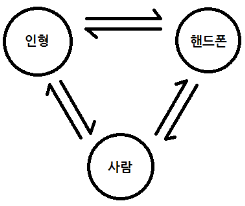
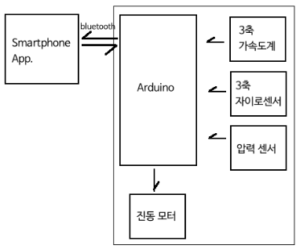

System design
=====
> 김지현, 노윤미, 송유정

### 1. 시스템 디자인 개요 및 시스템 논리 구조
 

* 곰 ↔ 인간
    * 안기, 껴안기, 가까이 있기, 귀가하기, 방치하기, 던지기, 흔들기, 깔아뭉개기, 나쁜말하기를 하면, 곰인형 안에 내장된 센서로 이를 감지한다.
    * 곰이 싫어하는 행동을 할 경우 진동모터로 반응한다.
* 곰 ↔ 스마트폰
    * 곰이 감지한 정보는 스마트폰에 블루투스 통신으로 전달된다.  모바일에서는 이 정보를 받아서 각 stat.을 계산하고 반영한다.
    * 특정한 조건을 충족시키면 곰이 반응하도록 다시 신호를 보낸다.
* 스마트폰 ↔ 인간
    * 특정한 조건을 만족하면 비주얼노벨과 비슷한 형식으로 대화 선택지 창이 뜬다.  어떠한 선택을 하느냐에 따라서 곰의 stat.이 달라지게 된다.
    * 곰의 성격, stat.을 확인할 수 있다.
    * app상에서 곰에게 먼저 말 걸기도 가능하다.

### 2. 입출력 센서

| 이름        | 가격 |
|-------------|-----:|
| [50cm 리락쿠마](http://www.coupang.com/vp/products/1840914?q=%EB%A6%AC%EB%9D%BD%EC%BF%A0%EB%A7%88+%EC%9D%B8%ED%98%95&rank=NaN&count=36&eventCategory=SRP&eventLabel=all_0) |33,500
| [3축 가속도계](http://www.vctec.co.kr/product/detail.html?product_no=889&cate_no=145&display_group=1)| 23,937
| [3축 자이로센서](http://www.vctec.co.kr/product/detail.html?product_no=868&cate_no=145&display_group=1)| 26,980
| [BLE](http://www.vctec.co.kr/product/detail.html?product_no=6455&cate_no=161&display_group=1) (질문 요망)| 16,946
| [아두이노 프로 마이크로](http://www.vctec.co.kr/product/detail.html?product_no=1278&cate_no=74&display_group=1) (질문 요망) | 23,980
| [아두이노 프로 미니 328 클론](http://www.vctec.co.kr/product/detail.html?product_no=5208&cate_no=74&display_group=1) (질문 요망) | 13,591
| [압력/온도 센서](http://www.vctec.co.kr/product/detail.html?product_no=6840&cate_no=145&display_group=1) (질문 요망) | 18,210
| [진동모터](http://www.vctec.co.kr/product/detail.html?product_no=6609&cate_no=203&display_group=1) | 5,346

### 3. 네트워크 및 유무선 사용
블루투스 low energy로 핸드폰과 정보 교환

### 4. 개발 도구
* mobile: react native (javascript)
* arduino: C++
